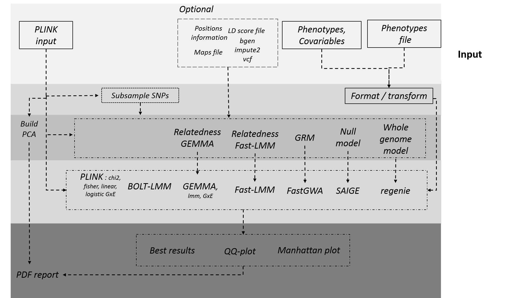

#  Association pipeline: `assoc/main.nf`

This workflow has been extensively expanded by Jean-Tristan Brandenburg

An association study is a complex analysis and each analysis has to consider
* the disease/phenotype being studied and its mode of inheritance
* population structure
* other covariates

For this reason it is difficult to build a high quality, generic pipeline to do an association study. 

The purpose of this pipeline is to perform a very superficial initial analysis that can be used as one piece of information to guide a rigorous analysis. Of course, we would encourage users to build their own Nextflow script for their rigorous analysis, perhaps using our script as a start.

Our script, *assoc* takes as input PLINK files that have been through quality control and 
* does a principal component analysis on the data, and produces pictures from that; 
* performs a simple association test giving odds ratio and  raw and adjusted _p_ values
## 0. Overview


## 1. Running the main association testing : general option

The pipeline is run: `nextflow run assoc`
By default a chi2 test for association is done. But you can do multiple different tests in one run by settintg the appropriate parameter to 1. Note at least one must be set to 1

The key options are:
### input / output 
* `input_dir`, `output_dir`: where input and output goes to and comes from;
* `input_pat`: the base of set of PLINK bed,bim and fam files (this should only match one);
### phenotype and data 
* `data`: a tab-separated file that contains phenotype data for your particpants. The row is a header line, with one participant per line after that. The first two columns should FID IID followed by any phenotype values you want to use for testing or for covariates. It can contain other data too -- as long as the ones that you need are in this file.
* `pheno`: a comma-separated list of phenotypes that you want to test. Each phenotype is tested separately. If you wish to do a transform to the phenottype, you can suffix the phenotype with _/function_ where function is a numpy function. For example you might say `--pheno bmi/np.log` which will apply the log function to the phenotype. Any numpy function can be used, typical uses being np.log and np.sqrt. We plan to support user provision of a user-given function.
* `covariates`: a comma-separated list of phenotypes that you want to use

### build reltdness 
* build relatdness and GRM, you have different way to buil matrix of relatdness for boltlmm, gemma, fast gwa or fastlmm, regenie
  * by default all snps are used and for boltlmm 950,000 are shuffled 
  * you can give a rs contains id or rs `file_rs_buildrelat` 
  * you can used `sample_snps_rel` (default 0), will used plink to sample snps :
    * `sample_snps_rel_paramplkl` : parameter for plink to obtained independnat pairwise ([default : 100 20 0.1 --maf 0.01 ])
    * `snps_include_rel` : bed file (chro begin end rs) to include on plink command to defined independant snps [default : ""]
  *  `file_rs_buildrelat` : file with rs list (one by lines) to build genetics models (relatdness), for gemma `-snps`,  boltlmm `--modelSnps`, regenie to build step 1
  
### other option 
* `genetic_map_file` : genetic map used in boltlmm 
*  `print_pca` : by default pipeline compute and print pca (`print_pca`=1), if you want avoid this step (`print_pca` = 0)
* `exclude_snps` option to exclude some snps active just for boltlmm (see `--exclude` in boltlmm manual) : SNP ID must be first column (default none)


## 3. Optionnal input
* optionnal input bgen ( for bolt, saige and fastGWA):
 * `bgen`  : bgen file
 * `bgen_sample` : list of sample 
 * `list_bgen` : file contains a list bgen, must be have at least `bgen_sample`
* specificity :
 * bolt-lmm : dosage bgen or impute2 in paralel with genotype plink file
 * saige :
  * vcf file are prioritise to bgen file (option bgen ignore for saibe)
  * relatdness done using genotype of plink
  * vcf priotise to bgen and bgen prioritise compared to plink genotype where association not done
 * regenie :
  * step 1 (reladness) done with plink
  * step 2 : bgen prioritise on plink 
 * fastgwa :
    * grm done using genotype of plink
    * bgen priotise on plink

| Software | plink | vcf | bgen | impute 2 |
| --- | --- | --- | --- | --- |
| gemma | yes |  no | no | no |
| plink association | yes |  no | no | no |
| gcta/fastGWA | yes |  no | yes | no |
| saige | yes |  yes | yes | no |
| bolt-LMM | yes |  no | yes | yes |
| fast-lmm | yes |  no | no | no |
| regenie | yes |  no | yes | no |
| --- | --- | --- | --- | --- |
| description | genotype |  dosage | dosage | dosage |
| --- | --- | --- | --- | --- |
| Option | `--input_dir`/`--input_pat`| `--list_vcf` | `--bgen`/`--bgen_sample` | `bolt_impute2filelist`/`bolt_impute2fidiid` |
| --- | --- | --- | --- | --- |

## 3. Association software  option 
### 1. plink association
 * `assoc` : should a chi2 test be used (0 or 1)
 * `fisher`: Fisher exact test (default 0)
 *  `linear`: should linear regreession be used?  (default 0)
 *  `logistic`: should linear regression be used? (default 0)
 * plink gwas option :
    * `adjust`: do we want to do explicit testing for Bonferroni correction et al that PLINK odes
    * `mperm`: do you want to test doing permutation testing. If so, how many tests?  By default this is 1000.
    * `sexinfo_available` presence of sex in plink file 1, yes 2 : no  [default : 0]

### 2. gemma option 
*  `gemma`: should gemma be used? (default 0)
*  see [manual](www.xzlab.org/software/GEMMAmanual.pdf)
* relatdness :
  *  `gemma_mat_rel` : file contains in gemma format matrix relatdness used by gemma  (format 1, see manual), matrix must be in same order than fam file. Avoid computation of relatdness by pipeline. 
 
* ressource usage :
 * `gemma_num_cores`: if gemma is used set this up to 8
 * `gemma_multi` : option run gemma by chromosome separately (is not a loco). to increase time computation and used more cpus, 0 no 1 yes [default : 0 (No)]

### 3. Bolt-LMM option
*  `boltlmm`: should boltlmm be used? 
*  see [manual](https://data.broadinstitute.org/alkesgroup/BOLT-LMM/)
* build relatdness model :
 * if SNPs is higher than 950,000, 950,000 SNPs are chosen randomly to build the model (see --modelSnps option in bolt)
* `covariates_type` / `bolt_covariates_type` : for bolt need to define if covariate is binary (0) or continue (1), a comma-separated list as same order than covariates 
 * `bolt_ld_score_file` : A table of reference LD scores for boltlmm is needed to calibrate the BOLT-LMM statistic (option in boltlmm --LDscoresFile),to choice a specific column in Ld file you can use `bolt_ld_scores_col` option (by default : LDSCORE) if option is not provided --LDscoresUseChip used.
 * `bolt_use_missing_cov` : option to "missing indicator method", by default no activate (0), to activate (1) (--covarUseMissingIndic option in boltlmm), which adds indicator variables demarcating missing status as additional covariates.
* ressource usage 
 * `bolt_num_cores` if bolt is used set this up to 8
 * `bolt_mem_req` memory required for boltlmm, (default : 6GB)

* dosage with Impute2 data in bolt  :
  * `bolt_impute2filelist` : list of impute2 files, each line contains : `chronumber` `file`, file must be in full pattern
  * `bolt_impute2fidiid` : list of individual in same order than `bolt_impute2filelist`
* bgen : see bgen previously

if bolt-LMM output are empty, algoritm canno't converge can be due to :
 * check .stdout and .stderr error
 * low sample size with less than 5000 individuals (bolt-LMM is recommended for 5000 individuals`

example of error :
```
ERROR: Heritability estimate is close to 0; LMM may not correct confounding
    Instead, use PC-corrected linear/logistic regression on unrelateds"
```
 * documentation of bolt-lmm : When a heritability estimate reaches 0, then linear mixed model association tests (including BOLT-LMM and other methods) all degenerate to simple linear regression, hence the error message. This situation is dangerous because the “mixed model” will no longer correct for population stratification and relatedness. 

```
“ERROR: Heritability estimate is close to 1; algorithm may not converge. Analysis may be unsuitable due to low sample size or case ascertainment.” 
```

* documentation of bolt-lmm :  This error most frequently arises when sample size is low, resulting in estimated heritability having a very large standard error (perhaps even greater than 1) such that the estimate could be anywhere in the range 0 to 1 and might hit one of the boundaries. BOLT-LMM is not recommended for analyses of smaller samples; in this situation, we recommend trying other software packages such as GEMMA or GCTA. 

### 4. fastlmm Option
*  `fastlmm`: should fastlmm be used?
 *  see [manual](https://github.com/MicrosoftGenomics/FaST-LMM)
 * `fastlmm_num_cores`: if fastmll is used set this up to 8
 * `fastlmm_mem_req`: memory required for fasttlmm (default : 15GB)
 * `fastlmm_multi` : memory used by fastmll is very big and increase with snp number, option run fastlmm by chromosome, with relatedness matrix computed before with gemma (-gk 1) 
 * `fastlmmc_bin` : should change binary for fastlmmc (default fastlmmc)
and then for all the tests except _gemma_, _boltlmm_ and _fastlmm_, do you want to adjust for multiple testing 

###  5. fastGWA option
* `fastGWA` :  do an analyse with fastGWA (GCTA), specific option [fastGWA manual](https://cnsgenomics.com/software/gcta/#fastGWA)
* fastgwa  (if 1 perfom fastGWA, otherwise no [default 0])
* `fastgwa_type` : [default : --fastGWA-mlm-exact]
* `fastgwa_mem_req` : memory for fastgwa and grm [default: 10G] 
* `fastgwa_num_cores` : cpus for fastgw and grm [default: 5]
* `covariates_type` : similar to `bolt_covariates_type`, give for each covariable type of covariable qualitatif (0) or quantitatif (1), must be len of covariates, if nothing, consider all covariable just as quantitatif covariable  [default ""] 
*  grm :
 * `gcta_grmfile` : index of file with grm with `gcta_grmfile`.grm.id and `gcta_grmfile`.grm.sp, if extension will not here, grm will build see below
 * to build grm :
 * `grm_nbpart` : nb part to build grm [default : 100]
 * `gcta64_bin` : binary for gcta64 [default : gcta64] 
 * `grm_cutoff` : cutoff value for  grm matrix (using option --make-bK-sparse) [default : 100]
 * `grm_maf` : cutoff value for frequencies and build grm matrix [default : 0.01]
* `gcta64_bin` : binary for gcta64 [default : gcta64] 

### 6. SAIGE option
* `saige` : perform association with saige, yes : 1, no : 0  [default, 0]
* saige used a plink file for computed and fit model, and can use vcf or bgen file with dosage or genotype with vcf file.
* `grm_maf` : cutoff value for frequencies and build grm matrix [default : 0.01]
* `saige_loco` : option for loco in saige  1: yes, other value no  [default : 1]
* `list_vcf` : file contains list of file vcf, one file by line  [default : ""], optional
* `vcf_field` : vcf field used for association [default : DS] :
  * GT : used genotype
  * DS : used dosage of imputation
* bin :
 * step 1 `saige_bin_fitmodel` : binary R for saige and fit model : [default : step1_fitNULLGLMM.R]
 * step2 `saige_bin_spatest` : binary R for saige and do association : [default : step2_SPAtests.R]
* ressource :
 * `saige_mem_req` : memory required for saige [default : 10GB] 
 * `saige_num_cores` : memory required for saige [default : 10], just used for step1 of SAIGE

### 7. Regnie option
* [more information relative to regenie](https://rgcgithub.github.io/regenie/options/)
*  `regenie_bin` : binary of regenie [default: regenie]
* `regenie` : perform a regenie analyse yes : 1, no : 0 [default : 0]
* bsize :
 * `regenie_mafstep1` : maf for step 1
 * `regenie_bsize` : bsize used for step 1 and 2 if `regenie_bsize_step1` and `regenie_bsize_step2` are 0 [default 100]
 * `regenie_bsize_step1` : bsize for step 1 [default 0]
* `regenie_bsize_step2` : bsize for step 2 [default 0]
* `regenie_otheropt_step1` : other option in command line of step 1
* `regenie_otheropt_step2` : other option in command line of step 2
* `regenie_loco` : option loco for bgen, yes : 1, no : 0, [default 1]
* `regenie_num_cores` : number of cpus used [default : 6]
* `regenie_mem_req` : number of cpus used [default : 20GB ]
with pipeline, do a GxE interaction with Gemma and Plink, arguments :

### GXE option (gemma and Plink)
* `gxe` : environmental variables to do gxe analysis with `pheno`, must be coded in 1 and 2 for plink
 * `gemma_gxe` : GxE interation with gemma [default : 0], see  `covariates` to add covariates in gemma models
 * pipeline computed frequencies, N for each group with plink and add to files
* `plink_gxe` : GxE interation with plink (see option -gxe, in [plink manual](http://zzz.bwh.harvard.edu/plink/anal.shtml#qtgxe)) [default : 0], no covariate could be provided.
 * pipeline computed frequencies, N for each group with plink and add to files, futhermore they add A1 and A2.
 * furthermore BetaGxE and SeGxE computed by pipeline as SeGxE : sqrt(se1^2 + se2^2), BetaGxE : Z\_GXE * SeGxE

##Other flags are:
* `thin`. You can set this to a floating point number in the range (0, 1] and then the PLINK data files are thinned leaving only that proportion of the SNPs. This allows pipeline to be tested with a small proportion of the data This is probably only needed for debugging purposes and usually this should not be be set.
* `chrom`. Only do testing on this chromosome.


##Example

### example 1
```nextflow run assoc/assoc.nf --input_pat raw-GWA-data --chi2 1 --logistic 1 --adjust 1```

analyses the files `raw-GWA-data` bed, bim, fam files and performs a chi2 and logistic regression test, and also does multiple testing correction.

### example 2
* Data and command line can be found [h3agwas-examples](https://github.com/h3abionet/h3agwas-examples)

```
nextflow run h3abionet/h3agwas/assoc --input_dir data/imputed/ --input_pat imput_data \
 --data data/pheno/pheno_test.all --pheno pheno_qt1,pheno_qt2 \
 --output_dir assoc --output assoc \
 --gemma 1 --assoc 1 --sample_snps_rel 1 --linear 1 \
  -profile slurmSingularity \
 --bgen data/imputed/bgen/out.bgen --bgen_sample data/imputed/bgen/out.sample
```


