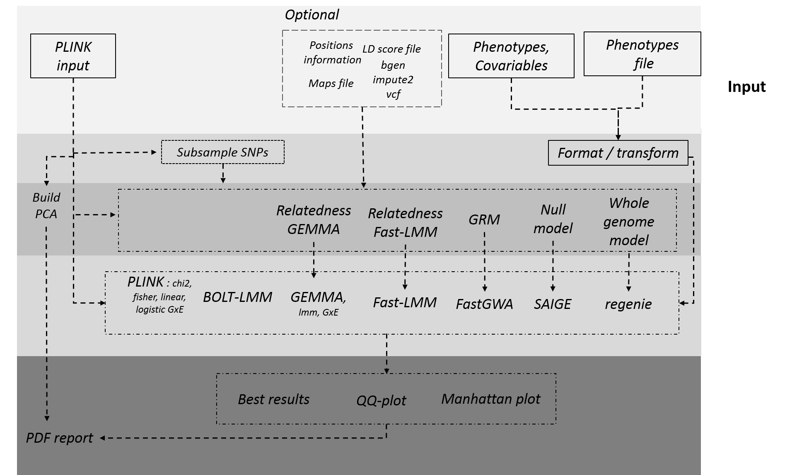

# Association Pipeline: `assoc/main.nf`

This workflow has been extensively expanded by **Jean-Tristan
Brandenburg**.

Genome-wide association studies (GWAS) are complex analyses that must
consider several aspects, including:

-   The **disease or phenotype** being studied and its mode of
    inheritance
-   **Population structure** and ancestry
-   **Covariates** such as sex, age, and environmental factors

Because of this complexity, it is difficult to design a fully generic
pipeline for association studies.

The goal of this pipeline is therefore to perform a **first-pass
association analysis**, providing preliminary results that can guide a
more rigorous downstream analysis. Users are encouraged to develop their
own customized Nextflow workflows for final analyses, potentially using
this pipeline as a starting point.

The **assoc** workflow takes **PLINK genotype files** (already quality
controlled) as input and performs:

-   **Principal Component Analysis (PCA)** with visualization
-   **Basic association tests** producing odds ratios and raw and
    adjusted *p*-values

------------------------------------------------------------------------

# 0. Overview

Pipeline overview:

    assoc/main.nf




------------------------------------------------------------------------

# 1. Running the Association Pipeline

The pipeline is executed with:

``` bash
nextflow run assoc
```

By default, a **Chi-square association test** is performed.

Multiple tests can be run simultaneously by setting the relevant
parameters to `1`.\
At least **one test must be enabled**.

------------------------------------------------------------------------

# 2. Input and Output Options

### Input / Output

  -----------------------------------------------------------------------
  Parameter                           Description
  ----------------------------------- -----------------------------------
  `input_dir`                         Directory containing input genotype
                                      files

  `output_dir`                        Output directory

  `input_pat`                         Prefix of PLINK files (`.bed`,
                                      `.bim`, `.fam`). Should match one
                                      dataset
  -----------------------------------------------------------------------

------------------------------------------------------------------------

# 3. Phenotype and Covariates

  -----------------------------------------------------------------------
  Parameter                           Description
  ----------------------------------- -----------------------------------
  `data`                              Tab-separated phenotype file. First
                                      columns must be `FID` and `IID`,
                                      followed by phenotype and covariate
                                      variables

  `pheno`                             Comma-separated list of phenotypes
                                      to test

  `covariates`                        Comma-separated list of covariates

  `pheno_bin`                         Indicates whether phenotype is
                                      binary (`1`) or quantitative (`0`,
                                      default)
  -----------------------------------------------------------------------

### Phenotype transformations

Phenotypes can be transformed using NumPy functions:

Example:

    --pheno bmi/np.log

Common transformations include:

-   `np.log`
-   `np.sqrt`

------------------------------------------------------------------------

# 4. Building the Relatedness Matrix (GRM)

The pipeline can construct a **genetic relatedness matrix** for
mixed-model methods (e.g., BOLT-LMM, GEMMA, REGENIE).

Options include:

  Parameter                    Description
  ---------------------------- ------------------------------------------------
  `file_rs_buildrelat`         File containing SNP IDs used to build the GRM
  `sample_snps_rel`            Sample SNPs for GRM construction (default: 0)
  `sample_snps_rel_paramplk`   PLINK parameters for LD pruning
  `snps_include_rel`           BED file specifying genomic regions to include
  `snp_rel_param_plk`          Additional PLINK parameters

Default behavior:

-   All SNPs are used
-   For **BOLT-LMM**, up to **950,000 SNPs** are randomly selected

------------------------------------------------------------------------

# 5. Additional Options

  Parameter            Description
  -------------------- ----------------------------------------------
  `genetic_map_file`   Genetic map used by BOLT-LMM
  `print_pca`          Compute and output PCA (default: `1`)
  `exclude_snps`       File listing SNPs to exclude (BOLT-LMM only)

------------------------------------------------------------------------

# 6. Optional Input Formats

In addition to PLINK files, the pipeline can use:

-   **VCF**
-   **BGEN**
-   **Impute2**

### BGEN options

  Parameter       Description
  --------------- --------------------
  `bgen`          BGEN genotype file
  `bgen_sample`   Sample file
  `list_bgen`     List of BGEN files

------------------------------------------------------------------------

# 7. Supported Association Software

  Software   PLINK   VCF   BGEN   Dosage   GxE
  ---------- ------- ----- ------ -------- -----
  GEMMA      ✔       ✘     ✘      ✘        ✔
  PLINK      ✔       ✘     ✘      ✘        ✔
  fastGWA    ✔       ✘     ✔      ✘        ✘
  SAIGE      ✔       ✔     ✔      ✔        ✘
  BOLT-LMM   ✔       ✘     ✔      ✔        ✘
  FaST-LMM   ✔       ✘     ✘      ✘        ✘
  REGENIE    ✔       ✘     ✔      ✔        ✔

------------------------------------------------------------------------

# 8. Association Methods

## 8.1 PLINK

  -----------------------------------------------------------------------
  Parameter                           Description
  ----------------------------------- -----------------------------------
  `assoc`                             Chi-square test

  `fisher`                            Fisher exact test

  `linear`                            Linear regression

  `logistic`                          Logistic regression

  `adjust`                            Multiple testing correction

  `mperm`                             Permutation testing

  `sexinfo_available`                 Indicates whether sex is recorded
                                      in PLINK file
  -----------------------------------------------------------------------

------------------------------------------------------------------------

## 8.2 GEMMA

  Parameter           Description
  ------------------- --------------------------------
  `gemma`             Enable GEMMA analysis
  `gemma_mat_rel`     Precomputed relatedness matrix
  `gemma_num_cores`   CPU allocation
  `gemma_mem_req`     Memory allocation
  `gemma_multi`       Run analysis per chromosome

------------------------------------------------------------------------

## 8.3 BOLT-LMM

  -----------------------------------------------------------------------
  Parameter                           Description
  ----------------------------------- -----------------------------------
  `boltlmm`                           Enable BOLT-LMM

  `bolt_num_cores`                    CPU allocation

  `bolt_mem_req`                      Memory requirement

  `bolt_ld_score_file`                Reference LD score file

  `bolt_covariates_type`              Covariate type (0 quantitative, 1
                                      categorical)
  -----------------------------------------------------------------------

⚠️ BOLT-LMM is recommended for datasets with **\>5,000 individuals**.

------------------------------------------------------------------------

## 8.4 FaST-LMM

  Parameter             Description
  --------------------- --------------------
  `fastlmm`             Enable FaST-LMM
  `fastlmm_num_cores`   CPU allocation
  `fastlmm_mem_req`     Memory requirement
  `fastlmm_multi`       Run per chromosome

------------------------------------------------------------------------

## 8.5 fastGWA (GCTA)

  Parameter             Description
  --------------------- --------------------
  `fastGWA`             Enable fastGWA
  `fastgwa_type`        Model type
  `fastgwa_mem_req`     Memory requirement
  `fastgwa_num_cores`   CPU allocation

------------------------------------------------------------------------

## 8.6 SAIGE

  Parameter         Description
  ----------------- ---------------------------------------
  `saige`           Enable SAIGE
  `saige_loco`      Leave-one-chromosome-out model
  `list_vcf`        List of VCF files
  `vcf_field`       Field used for association (GT or DS)
  `saige_mem_req`   Memory requirement

------------------------------------------------------------------------

## 8.7 REGENIE

  Parameter             Description
  --------------------- --------------------
  `regenie`             Enable REGENIE
  `regenie_bin`         REGENIE binary
  `regenie_bsize`       Block size
  `regenie_num_cores`   CPU allocation
  `regenie_mem_req`     Memory requirement

------------------------------------------------------------------------

# 9. Gene-Environment Interaction (GxE)

Supported in:

-   **PLINK**
-   **GEMMA**
-   **REGENIE**

Parameter:

    --gxe

Environmental variables must be coded **1 or 2** for PLINK.

------------------------------------------------------------------------

# 10. Additional Flags

  Parameter   Description
  ----------- ----------------------------------------------
  `thin`      Randomly keep a fraction of SNPs (debugging)
  `chrom`     Restrict analysis to a specific chromosome

------------------------------------------------------------------------

# 11. Example Runs

### Example 1

``` bash
nextflow run assoc/assoc.nf  --input_pat raw-GWA-data  --assoc 1  --logistic 1  --adjust 1
```

### Example 2

Example data available at:

https://github.com/h3abionet/h3agwas-examples

``` bash
nextflow run h3abionet/h3agwas/assoc  --input_dir data/imputed  --input_pat imput_data  --data data/pheno/pheno_test.all  --pheno pheno_qt1,pheno_qt2  --output_dir assoc  --output assoc  --gemma 1  --assoc 1  --sample_snps_rel 1  --linear 1  -profile slurmSingularity  --bgen data/imputed/bgen/out.bgen  --bgen_sample data/imputed/bgen/out.sample
```
