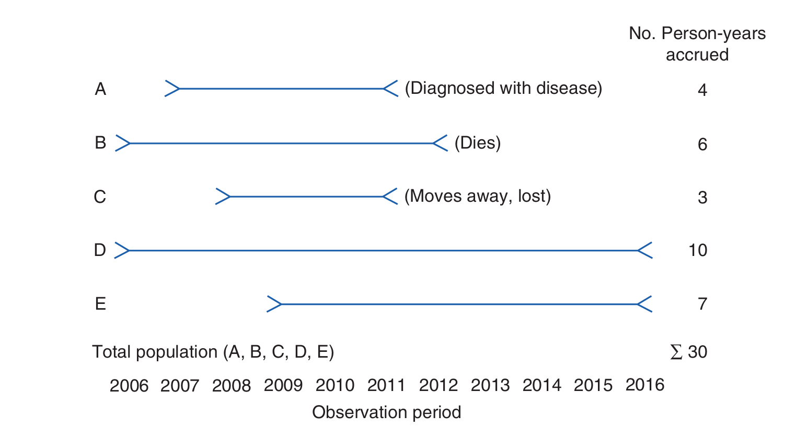
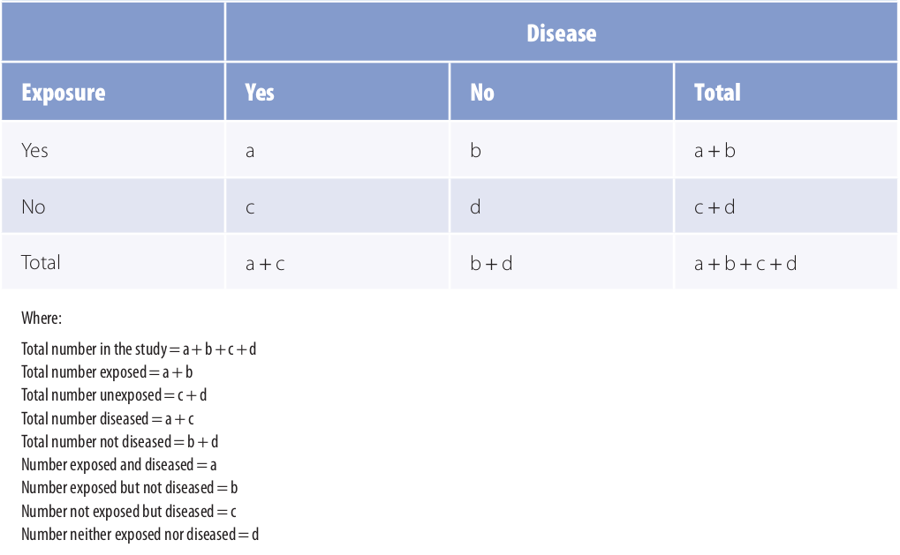
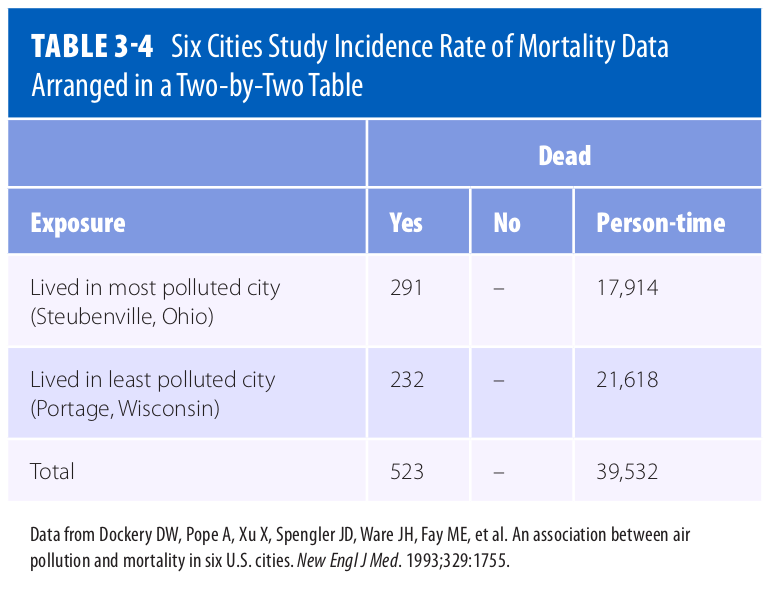

------



------

In episode 1 we defined the disease frequency of a population as some measure of how often a disease occurs in that population. There are many ways one can define this measure, and for any given case our choice will depend on the data at hand, the hypothesis of the study, or prevailing conventions in the  epidemiology literature. In this section we will look at some of the ways in which such a measure could be defined, and how to calculate it from a data set. Estimating the disease frequency, using some chosen measure of this frequency, for a given population is one of the first steps in analysing the pattern of disease in the population, working out determinants, and in planning effective control strategies. 

To estimate the frequency of a disease in a population, epidemiologists must:
1. develop a concrete definition of the disease,
2. count the number of people affected by the disease,
3. determine the size of the population from which the disease cases arose,
4. and account for the passage of time. 

We will now look at these steps in more detail.

# How do we determine who has a disease?

As the list of steps above suggests, we first need a definition of the disease in question, and a definition of the population. These definitions need to be concrete so that we can successfully count both the members of the population, and count those members whom are affected by the disease.

The population is the set of all people of interest *who could potentially contract the disease*. For example, in a study of cervical cancer it would not be sensible to include men in the study population because we already know precisely the factor that protects men from cervical cancer, namely they do not have a cervix. It is helpful to focus on what is *not known before the study begins*, in this case, why some women in a population may contract the disease and others do not. The definition of a study population in each study is therefore closely related to the investigators' initial scientific question. In the above example, this question would be: why do some women contract cervical cancer and others do not? We may also restrict our attention to a specific population for means of study convenience; it may only be practical to consider the population of women living on the banks of the Zambezi river because the study was initiated in response to a particular health crisis there. The study question would in this case be: why do some women living next to the Zambezi river contract cervical cancer and others do not?

The definition of a disease is usually based on a combination of physical and pathological examinations, diagnostic test results, and signs
and symptoms. Which and how many criteria are used to define a “case” (a person who meets the disease definition) has important implications
for accurately determining who has the disease.

> ## Challenge
> Why is it good practice to include the definition of the disease in the study report?
> > ## Solution
> > Publicly accepted definitions of diseases are likely to change over time, as new information is found or public perceptions change. It is important that investigators are clear on the precise definition used in the study, so that readers of the report in the future may understand exactly what was shown.
> {: .solution}
{: .challenge}

# Incidence
**Incidence** is defined as the occurrence of new cases of disease that develop in a candidate population over a specified time period. There are two important measures of incidence: cumulative incidence and incidence rate. Both measures are closely related but in a given context one can be more useful than the other. 

**Cumulative incidence** is defined as the proportion of a candidate population that becomes diseased over a specified period of time. Mathematically, it is expressed as follows.
> ## Cumulative incidence
>Let $$P$$ be a population with $$n$$ members. Consider a fixed time period, $$t$$, and let $$m$$ be the number of new cases (members of $$P$$ who contract the disease) over the time period $$t$$. The **cumulative incidence** of the disease for the population $$P$$ over the time period $$t$$ is:
>
>$$c := \frac{m}{n}$${: font-size: 120%; text-align: center;"}
{: .callout}

By convention, if a member of $$P$$ contracts the disease more than once over the specified time period, then only the first case is counted, and therefore $$c$$ may only take values between 0 and 1. For this reason it is often quoted as a percentage, namely taking values between 0% and 100%. It is clear from the definition that $$c$$ is always a dimensionless value. 

> ## Example
> *Question -* Consider the population of a small imaginary town with 10000 residents. Imagine that, for an influenza study, investigators monitor the residents of this town for a year, from June 1st 2021 till June 1st 2022. Over this time period, say that a flu outbreak occurs just after June 1st 2021, and continues to spread. Let us say that, by June 1st, 2123 residents of the town have contracted the flu once, and no resident was affected twice in the time period.
> What is the cumulative incidence $$c$$ of flu on the residents of the town for the time period of the study?
>
> *Solution -* Using the above definition, we may deduce for our example that $$P$$ is the set of residents of the town and so $$n=10000$$, $$t$$ is June 1st 2021 till June 1st 2022, and the number of cases $$m=2123$$. Therefore the cumulative incidence $$c$$ of flu on the residents of the town for the time period of the study is: $$c = 2123 / 10000 = 0.2123$$.
{: .example}

Note that this definition of $$c$$ depends on the time period as well as the population and the disease definition used. For example, we may define a case as a person showing flu-like symptoms, or we may be more accurate and test each person for the presence of a specific antibody. Changes in any of these factors will result in changes to the final value of $$c$$.

**Incidence rate** is defined as the occurrence of new cases of disease that arise during person-time of observation. Before we can define the incidence rate mathematically, we need to clarify what we mean by person time, which can be a confusing concept. 
> ## Person time
>Let $$P$$ be a population, with $$x$$ any member of $$P$$. Consider a study whereby person $$x$$ is followed for a fixed time period $$t$$ that has a duration $$|t|$$. Then, the **person-time** that has been accrued in this study by following $$x$$ over the time period $$t$$ is:
>
>$$p := |t|$${: font-size: 120%; text-align: center;"}
{: .callout}

Person-time is *additive*, in the sense that the person-time of two individuals in a study is the sum of the two individual person-times. In addition, we may stop following an individual in a study for one of three reasons:
1. the person contracts the disease (becomes a case),
2. the person dies,
3. or the person is lost to follow-up.

In either of these cases, the time period $$t$$ ends for that person and the person-time is computed as the duration between the beginning of the study and this endpoint. 

> ## Example
> *Question -* A small study follows a group of 4 people, A, B, C and D, for a period of 5 years. The disease under investigation is Malaria. The study begins on 3rd December 2020 and ends 3rd December 2025. During this time, person A contracts malaria on the 2nd January 2022; person B survives the time period without contracting malaria; person C dies from an unrelated cause on 24th March 2024 and person D moves away from the study catchment area, and is no longer contactable, on 14th of February 2023. Find the person time of each participant, A, B, C, D, and the person-time of the entire study.
>
> *Solution -* The person-time of A, $$p_A$$, is $$395 days$$; the person-time of B, $$p_B$$, is $$1826 days$$; the person-time of C, $$p_C$$, is $$1207 days$$; and the person time of D, $$p_D$$, is $$803 days$$. Since person-time is additive, the total person-time of the study is $$p_A + p_B + p_C + p_D = (395 + 1826 + 1207 + 803) days = 4231 days$$.
{: .example}

Note that the units of person-time is time. In the above example we chose days but this could be weeks, months, years e.t.c.

This idea of person-time is illustrated below for a related (but different!) example.

We may now define the incidence rate. Mathematically, the incidence rate is expressed as follows.
> ## Incidence rate
> Let $$P$$ be a study population. Let $$p$$ be the person-time of the study, and let $$m$$ be the number of new cases of the disease recorded in the population (repeated cases are not counted). Then the incidence rate of the study is:
>
>$$i := \frac{m}{p}$${: font-size: 120%; text-align: center;"}
{: .callout}

> ## Example
> *Question -* Recall the above example of person-time in a malaria study. What is the incidence rate of malaria for this study?
>
> *Solution -* We see that only person A actually contracted malaria. Therefore, we have that $$m=1$$ and as we previously calculated, $$p = p_A + p_B + p_C + p_D = 4231 days$$, which means the incidence rate $$i$$ = $$\frac{1}{4231 days}$$.
{: .example}

From this example we see that the units of incidence rate is 1/time. 

> ## Challenge
> What assumption is being made by the cumulative frequency measure about the study population that is not made by the incidence rate measure?
> > ## Solution
> > The incidence rate is clearly a more accurate measure of the disease frequency than the cumulative incidence, since the cumulative incidence is based on the assumption that *all study participants are followed for the entire study duration*, which is usually not the case in practice. The incidence rate does not use this assumption. 
> {: .solution}
{: .challenge}

# Prevalence
Whereas incidence measures the frequency with which new disease develops, **prevalence** measures the frequency of existing disease. It is simply defined as the proportion of the total population that is diseased. There are two types of prevalence measures—point prevalence and period prevalence—that relate prevalence to different amounts of time. **Point prevalence** refers to the proportion of the population that is diseased at a single point in time and can be thought of as a single snapshot of the population. The point can be either a particular calendar date such as July 1, 2017, or a point in someone’s life, such as college graduation. **Period prevalence** refers to the proportion of the population that is diseased during a specified duration of time, such as during the year 2017. The period prevalence includes the number of cases that were present at any time over the course of the year.

Mathematically, these two measures of prevalence are defined as follows.
> ## point prevalence
> Let $$P$$ be a population, with number of members $$n$$. Let $$t$$ be a single point in time, and let the total number of disease cases in $$P$$ at $$t$$ be $$m$$. Then, the point prevalence of the disease in the population $$P$$ at the time $$t$$ is given by:
>
> $$\frac{m}{n}$${: font-size: 120%; text-align: center;"}
{: .callout}

> ## point prevalence
> Let $$P$$ be a population, with number of members $$n$$. Let $$t$$ be a period of time, and let the total number of disease cases in $$P$$ during $$t$$ be $$m$$. Then, the point prevalence of the disease in the population $$P$$ at the time $$t$$ is given by:
>
> $$\frac{m}{n}$${: font-size: 120%; text-align: center;"}
{: .callout}

In the following example, we use these formulas to calculate the point and period prevalence of pneumonia in a nursing home population. 

> ## Example
> *Question -* A study is conducted on malaria in a nursing home population. A point and period of interest for the study are July 1, 2017, and January 1 through December 31, 2017, respectively. On July 1, 2017, there were $$m=5$$ cases of pneumonia among the $$n=500$$ nursing home residents. During the period January 1 through December 31, 2017, there were 45 cases of pneumonia among the 500 nursing home residents. 
>
> *Solution -* The point prevalence of pneumonia was 5/500, or 1%, on July 1, 2017. The period prevalence was 45/500, or 9%, during 2017. 
{: .example}
Note that, in the above example, the size of the nursing home population remained stable over the year, but if it had gained or lost members, the average size of the nursing home population during 2017 would have been the appropriate denominator for the period prevalence measure.

Epidemiologists and other public health professionals use each measure of disease frequency for specific purposes. Incidence is
most useful for evaluating the effectiveness of programs that try to prevent disease from occurring in the first place. In addition, researchers
who study the causes of disease prefer to study new cases (incidence) over existing ones (prevalence) because they are usually interested in exposures that lead to developing the disease. Prevalence obscures causal relationships *because it combines incidence and survival*. In addition,
many researchers prefer to use incidence because the timing of exposures in relation to disease occurrence can be determined more accurately.

On the other hand, prevalence is useful for estimating the needs of medical facilities and allocating resources for treating people who already have a disease. In addition, researchers who study diseases such as birth defects (wherein it is difficult to gather information on defects present in miscarried and aborted fetuses) and chronic conditions such as arthritis (whose beginnings are difficult to pinpoint) have no choice but to use prevalence. Unfortunately, results of such studies are difficult to interpret because it is unclear how much the association is influenced by using a group of survivors.

# How do we compare disease frequencies 

As we have just seen, measures of disease frequency are the building blocks epidemiologists use to assess the effects of a disease on a population. 
We will now see that comparisons of measures of disease frequency allow for meaningful groupings that allow one to describe the relationship between a characteristic and a disease. This allows us to assess the public health effect of the exposure. Disease frequencies can be compared between different populations or between subgroups within a population. For example, one might be interested in comparing disease frequencies between residents in Tanzania and Ghana or between subgroups of sickle cell patients within Nigeria according to haematological characteristics, such as teal hemoglobin (HbF) level.

Usually, people who have a particular characteristic such as high foetal haemoglobin (HbF) level are compared with those who do not share the charateristic. This characteristic is often called the **exposure** and those who have the characteristic form the exposed or the index group while those without the characteristic form the unexposed or referent group. In instances in which no group is clearly unexposed, for instance a group of SCD patients who have higher than normal HbF level, the group with the lowest exposure e.g. lowest HbF level is typically used as the unexposed group.

> ## Example
> To test the hypothesis that HbF is associated with increased survival of SCD patients, one could compare the level of HbF among adult SCD patients (exposed group) to that of adults without SCD (unexposed group).
{: .example}

# Data Organizations
---
To compare disease frequencies, epidemiologists first organize the data in a “two-by-two” or “fourfold” table, so called because data are cross tabulated by two categories of exposure (yes or no) and two categories of disease (yes or no) (**Table 1**).

**Table 1**: General Organization of Cumulative Incidence or Prevalence Data in a Two-by-Two Table

 *Adapted from* [^1]

The outermost row and column numbers are called the margins of the table (e.g., a + b), and the numbers in the inner area are called the cells (a, b, c, d). Some epidemiologists may prefere to arrange the table with exposure across the top and disease status to the side. In such a case, one must be careful to also make appopriate changes to the formulas.

## Measures of Comparison
Measures of disease frequency can be compared in two ways. They can be subtracted from one another (**absolute comparisons**) or divided by one another (**relative comparisons**). Absolute comparisons generally give information about the public health impact of an exposure, and relative comparisons generally give information about the strength of the relationship between an exposure and a disease.

### A) Absolute Measures of Comparison

A general term for this comparison is the **risk difference** or rate difference. Absolute comparisons can be calculated for either exposed individuals or the total population. When exposed individuals are the focus, the absolute difference measure is calculated as follows:

$$RD=R_e - R_u$$

where $$RD$$ is the rate or risk difference, $$R_e$$ is the rate or risk in the exposed group (for instance the mortality rate in individuals with SCD), and $$R_u$$ is the rate or risk in the unexposed group (for instance the mortality rate in normal individuals).
 
The $$RD$$ describes the disease burden associated with exposure among exposed people. Or simply put, it is the excess risk or rate of disease or outcome associated with the exposure.

---
> ## Challenge
> Considering our example of mortality rate in SCD versus normal individuals, what would $$RD$$ be?
> > ## Solution
> > Excess mortality
> {: .solution}
{: .challenge}
---

Assuming that the exposure is a direct cause of the disease, then $$RD$$ can be used to calculate the number of disease cases that would be eliminated if the exposure were eliminated (or reduced to the level of the unexposed group).

 *Adapted from* [^1]

> ## Example
>*Question -* Consider the data presented in Table 3.4 of [^1]. What is the Incidence Rate Difference (IRD) of mortality for this data set? Breifly interpret your result in words.
>
>*Solution -* To calculate the IRD, first we calculate the Incidence Rate (IR) for Steubenville:
>
>$$IR_{Steubenville} = \frac{291}{17,914} = \frac{16.24}{1,000}(person-years)$$
>
> Then we calculate the IR for Portage:
>
>$$IR_{Portage} = \frac{232}{21,618} = \frac{10.73}{1,000}(person-years)$$
>
> Finally we calculate the IRD by taking the positive difference:
>
>$$IRD = IR_{most\ polluted\ city} - IR_{least\ polluted\ city}$$
>
>$$= \frac{16.24}{1,000}(person-years) - \frac{10.73}{1,000}(person-years)$$
>
>$$= \frac{5.51}{1,000}(person-years)$$
>
>Interpreted narrowly, there are 5.51 excess deaths per 1,000 person-years among Steubenville residents. Or, more broadly, if pollution caused the deaths, then 5.51 deaths among Steubenville residents for every 1,000 person-years of observation would be eliminated if the pollution level were reduced to that of Portage. 
{: .example}

To obtain the actual number of excess cases, simply multiply the excess risk or rate by the number of exposed people. Given that a population usually consists of both exposed and unexposed people, it is therefore useful to know the impact of the exposure not only on the exposed, but also on the unexposed group, hence the total population. **Population risk difference** is the term used to describe this comparison, and is calculated as follows:

$$PRD = R_t - R_u$$

where $$PRD$$ is the population rate/risk difference, $$R_t$$ is the rate or risk in the total population, and $$R_u$$ is the rate or risk in the unexposed group.

It is also possible to obtain the population rate difference by multiplying the risk or rate difference ($$RD$$) by the proportion of the population that is exposed ($$P_e$$ ):

$$PRD = RD\ ×\ P_e$$

where $$P_e$$ is the proportion of the population that is exposed. The $$PRD$$ describes the excess number of cases in the total population that is associated with the exposure. Like $$IRD$$, $$PRD$$ dentifies the number of cases of disease that would be eliminated in the total population if the exposure were eliminated (or reduced to the level in the unexposed group).

We see from the formulas that, unless everyone in the population is exposed, the impact of the exposure is always smaller in the total population than in the exposed group and therefore the $$PRD$$ is always smaller than the $$RD$$. The units and range of the absolute measures of comparison ($$RD$$ and $$PRD$$) depend on the measure of disease frequency that is used for the calculation. For example, if incidence rates are used, then the measure will have **person-time** units and can range from negative infinity to positive infinity. On the other hand, if one uses cumulative incidence or prevalence, the measure is dimensionless and can range from −1 to +1.

### B) Relative Measures of Comparison
A relative measure of comparison is based on the ratio of two measures of disease frequency. This measure is generally called the **risk ratio**, rate ratio, relative rate, or **relative risk**. Mathematically, the relative measure is expressed as follows:

$$RR = \frac{R_e}{R_u}$$

where $$RR$$ is the rate or risk ratio or relative risk; $$R_e$$ is the incidence rate, cumulative incidence, or prevalence in the exposed group; and $$R_u$$ is the incidence rate, cumulative incidence, or prevalence in the unexposed group. This measure gives information about the strength of the relationship between the exposure and disease and is most useful in etiological studies.

> ## Example
> *Question -* Consider the data in Table 3.4 above. What is the relative risk of mortality given this data?
>
> *Solution -* Using the answers of the previous example, the relative risk (RR) is:
>
> $$RR = \frac{\frac{16.24}{1,000}(person-years)}{\frac{10.73}{1,000}(person-years)} = 1.51$$
>
> This means that, compared with the residents of Portage, there is a 1.51-fold increased rate of death among residents of Steubenville. Another interpretation is that the death rate in Steubenville is 1.51 times that of Portage.
{: .example}

Another way to express this information is in terms of the **excess relative rate**, which is mathematically equal to:

$$(RR - 1) × 100$$

---
> ## Challenge
> > 1. Using the previous example in which $$RR = 1.51$$, calculate the excess relative rate. What does the value mean?
> > 2. Assuming that the relative risk of renal complication in SCD individuals with the 3.7 kb alpha-thalassemia deletion as compared to SCD individuals without the mutation is 0.20, calculate the excess relative risk. Explain the meaning of the value.
> {: .challenge}
> > ## Solution
> > 1. Excess $$RR = (1.51 - 1) × 100 = 51\%.$$ This means that compared with the residents of Portage, the residents of Steubenville have a 51% increased rate of death.
> > 2. Excess $$RR = (1 - 0.20) × 100 = 80\%.$$ This means that compared with SCD individuals who lack the 3.7 kb alpha-thalassemia deletion, SCD individuals with the mutation have an 80% reduced risk of renal complications.
> {: .solution}
{: .challenge}
----

Most epidemiologists prefer to use the relative method of comparison for etiologic research because it indicates how many times higher or lower the disease risk is among the exposed as compared with the baseline risk among the unexposed.

### Data Standardization
It is difficult to interpret absolute and relative measures of comparison that are based on crude rates when the compared groups differ on a characteristic that affects the rate of disease (such as age, gender, or race). This difference between the groups may result in an unfair comparison and distort the results.

Calculation of characteristic-specific comparisons such as comparisons among exposed and unexposed individuals of a particular age (age-specific comparison) should give a more accurate picture of rates. However, because there are usually many age groups to examine, this method results in a cumbersome number of comparisons. Furthermore, comparing age-specific rates can give a confusing picture if some of the rates are higher in one state and some are higher in the other. 
Epidemiologists commonly use an alternative method in which the rates in each state are summarized in a single number that adjusts for the age differences between the populations. These summary rates, which are known as age-standardized or age-adjusted rates, answer the question, “What would the death rate be in each state if the populations had identical age distributions?”

---
> ## Quiz
> > 1. State one example of an absolute measure of comparison in the context of SCD
> > 2. What does a relative risk ($$RR$$) value of 1.0 mean?
> > 3. Why is it important to standadize data before calculating measures of comparison?
> {: .challenge}
> > ## Solutions
> > 1. Excess mortality
> > 2. A relative risk of 1.0 means there is no relationship between the exposure and disease.
> > 3. Measures of comparison calculated on crude rates when the compared groups differ on a characteristic that affects the rate could be inaccurate.
> {: .solution}
{: .challenge}
---

## References

[^1]: Ann Aschengrau and George R. Seage III, Essentials of epidemiology in public health, Fourth edition (2020, Jones & Bartlett Learning)---
