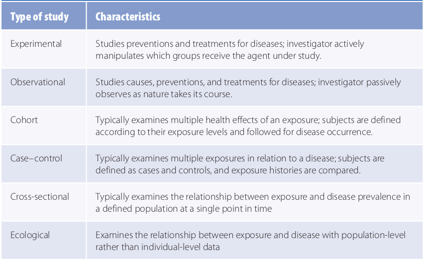
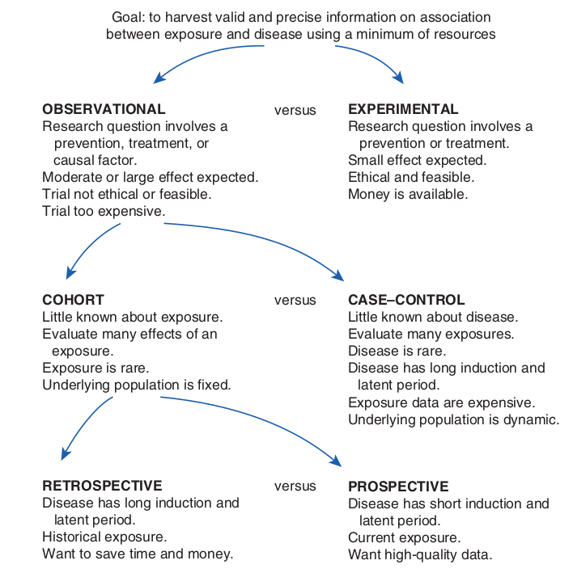

## Introduction
The term **study** in epidemiology includes both­ **surveillance**, whose purpose is to monitor aspects of disease occurrence and spread that are pertinent to effective control, and **epidemiological research**. The goal of epidemiological research is to harvest valid and precise information about the causes, preventions, and treatments for disease. There are several types of study designs in emidemiological research, including experimental studies and observational studies such as cohort and case-control studies. Each study design represents a different way of harvesting information. The selection of one design over another depends on the particular research question, concerns about validity and efficiency, and practical and ethical considerations. For example, experimental studies, also known as trials, investigate the role of some factor or agent in the prevention or treatment of a disease. In this type of study, the investigator assigns individuals to two or more groups that either receive or do not receive the preventive or therapeutic agent. Because experimental studies closely resemble controlled laboratory investigations, they are thought to produce the most scientifically rigorous data
of all the designs.

However, experimental studies are often infeasible because of difficulties enrolling participants, high costs, and ethical issues. Most epidemiological research is conducted using an observational study, which is considered a “natural” experiment because the investigator lets nature take its course. Observational studies take advantage of the fact that people are exposed to noxious and/or healthy substances through their personal habits, occupation, place of residence, and so on. The studies provide information on exposures that occur in natural settings, and they are not limited to preventions and treatments. Furthermore, they do not suffer from the ethical and feasibility issues of experimental studies. For example, although it is unethical to conduct an experimental study of the effect of drinking alcohol on the developing fetus by assigning newly pregnant women to either a drinking or nondrinking group, it is perfectly ethical to conduct an observational study by comparing women who choose to drink during pregnancy with those who decide not.

The two principal types of observational studies are cohort and case–control studies. Additional observational study designs include cross-sectional studies and ecological studies. In this module, we shall look at experimental studies, as well as the observational cohort, case-control, and cross-sectional studies.

### Study types

---
Figure 1: Summary of epidemiological study types

 *Adapted from* [^1]

---

#### A) Experimental studies (trials)
An experimental study, also known as a **trial**, investigates the role of some agent in the prevention or treatment of a disease. In this type of study, the **investigator assigns individuals to two or more groups** that either receive or do not receive the preventive or therapeutic agent. The group that is allocated the agent under study is generally called the **treatment group**, and the group that is not allocated the agent under study is called the
**comparison group**. Depending on the purpose of the trial, the comparison group may receive no treatment at all, an inactive treatment such as a placebo, or another active treatment.

The active manipulation of the agent by the investigator is the hallmark that distinguishes experimental from observational studies. 

---
> ## Note
> - In experimental studies, the investigator assigns individuals to two or more groups. **Treatment group** receives a preventive or therapeutic agent. **Comparison group** does not receives the agent, or receive a placebo or another active treatment.
> - In observational studies, the investigator acts as a passive observer, merely **letting nature take its course**.
{: .callout}
---

Experimental studies are commonly classified by their objective, that is, by whether they investigate a measure that prevents disease occurrence (preventive or prophylactic trial) or a measure that treats an existing condition (therapeutic or clinical trial).

---
> > ## Question
> > A clinical trial is an experimental study that investigates a measure that prevents diease occurrence. True or false?
> {: .challenge}
> > ## Answer
> > False - a clinical trial is an experimental study that investigates a measure that **treats an existing condition**.
> {: .solution}
{: .challenge}
---
> ## Hydroxyurea in Sickle Cell Disease: Clinical trials
> Hydroxyurea (HU) is a medicine that is used to treat some cancers. But it can also help children and adults who have sickle cell disease. The evidence that HU could be helpful in SCD came from clinical trials that were conducted in the USA in the 1980s [^2]. Multiple clinical trials have since proven the efficacy and safety of HU in treating SCD patients including the REACH [^3] and NOHARM [^4] trials in Africa, and the BABY-HUG [^5] and HUSOFT [^6] trials in the USA.
{: .callout}
---

##### Selection of Study Population

During the recruitment phase of an experimental study, the study population, which is also called the experimental population, is enrolled on the basis of eligibility criteria that reflect the purpose of the trial as well as scientific, safety, and practical considerations. For example, healthy or high-risk individuals are enrolled in
prevention trials, whereas individ uals with specific diseases are enrolled in therapeutic trials. Additional inclusion and exclusion criteria may be used to restrict the study population by factors such as gender and age (See Standadization of rates under the episode [Comparing disease frequencies]({{ page.root }})). The study population must include an adequate number of individuals to determine whether there is a true difference between the treatment and
comparison groups. An investigator determines how many subjects to include by using formulas that take into account the anticipated difference between the groups, the background rate of the outcome, and the probability of making certain statistical errors (See episode on [measures of disease frequency]({{ page.root }})). 
In general, smaller anticipated differences between the treatment and comparison groups require larger sample sizes.

##### Consent process and treatment assignment
All eligible and willing individuals must give consent to participate in an experimental study. The process of gaining their agreement is known as informed consent. The investigator must describe the nature and objectives of the study, the tasks required of the participants, and the benefits and risks of participating. Individuals are then assigned to receive one of the two or more treatments being compared. Randomization, “an act of assigning or ordering that is the result of a random process

---
> ## Question: Select the correct option.
> In a trial, the investigator manipulates a therapeutic agent in the
> > ## Options
> > - (A) agent group
> > - (B) comparison group
> > - (C) experimental group
> > - (D) treament group
> {: .challenge}
> > ## Answer
> > - [ ] agent group
> > - [ ] comparison group
> > - [ ] experimental group
> > - [x] treament group **(D)**
> {: .solution}
{: .challenge}
---

##### Treatment Administration
In the next phase of a trial, the treatments are administered according to a specific protocol. For example, in a therapeutic trial, participants may be asked to take either an active drug or an inactive drug known as a placebo. The purpose of placebos is to match as closely as possible the experience of the comparison group with that of the treatment group. Also, the use of placebos means that study participants and investigators may be prevented from knowing whom receives an active agent or not (masking), which helps to prevent biases.

##### Maintenance and Assessment of Compliance
All experimental studies require the active involvement and cooperation of participants. Although participants are apprised of the study requirements when they enroll, many fail to follow the protocol exactly as required as the trial proceeds. The failure to observe the requirements of the protocol is known as **noncompliance**, and this may occur in the treatment group, the comparison group, or both. Reasons for not complying include toxic reactions to the treatment, waning interest, and desire to seek other therapies. Noncompliance is problematic because it results in a smaller difference between the treatment and comparison groups than truly exists, thereby diluting the real effect of a treatment. A **run-in** period is usually used before enrollment and randomization to ascertain which potential participants are able to comply with the study regimen. During this period, participants are placed on the test or comparison treatment to assess their tolerance and acceptance and to obtain information on compliance.

##### Ascertaining the Outcomes
During the follow-up stage of an experimental study, the treatment and comparison groups are monitored for the outcomes under study. If the study’s goal is to prevent the occurrence of disease, the outcomes may include the precursors of disease or the first occurrence of disease (i.e., incidence). If the study is investigating a new treatment among individuals who already have a disease, the outcomes may include disease recurrence, symptom improvement, length of survival, or side effects The length of follow-up depends on the particular outcome under study.
It can range from a few months to a few decades.

##### Analysis
The classic analytic approach for an experimental study is known as an **intent-to-treat** or **treatment assignment analysis**. In this analysis, all individuals who were randomly allocated to a treatment are analyzed regardless of whether they completed the regimen or received the treatment. An intent-to-treat analysis gives information on the effectiveness of a treatment under everyday practice conditions. The alternative to an intent-to-treat analysis is known as an efficacy analysis, which determines the treatment effects under ideal conditions, such as when participants take the full treatment exactly as directed.

---
> ## Question
> What is **masking** in clinical trials, and how is it useful?
> > ## Qnswer
> > Masking is the act of concealing the true identity of an active agent from the participants and investigators in a clinical trial. It helps prevent biases in the ascertainment of outcomes.
> {: .solution}
{: .challenge}

---

#### B. Cohort Studies
A **cohort** is defined as a group of people with a common characteristic or experience. In a cohort study, healthy subjects are defined according to their exposure status and followed over time to determine the incidence of symptoms, disease, or death. The common characteristic for grouping subjects is their exposure level. Usually, two groups are compared: an **exposed** and an **unexposed** group. The unexposed group is called the reference, referent, or comparison group. Cohort study is the term that is typically used to describe an epidemiological investigation that follows groups with common characteristics. Other expressions that are used include follow-up, incidence, or longitudinal study. The **term fixed** cohort is used when the cohort is formed on the basis of an irrevocable event, such as undergoing a medical procedure. Thus, an individual’s exposure in a fixed cohort does not change over time. A **closed cohort**
is used to describe a fixed cohort with no losses to follow-up. In contrast, a cohort study conducted in an **open population**, also known as a **dynamic population**, is defined by exposures that can change over time, such as cigarette smoking.

##### Timing of cohort studies
Three terms are used to describe the timing of events in a cohort study in relation to the initiation of the study: prospective, retrospective, and ambidirectional. At the initiation of a **prospective cohort** study, participants are grouped on the basis of past or current exposure and are followed into the future to observe the outcomes of interest. When the study commences, the outcomes have not yet developed, and the investigator must wait for them to occur. At the initiation of a **retrospective cohort** study, both the exposures and outcomes have already occurred when the study begins. Thus, this type of investigation studies only prior and not  future outcomes. An **ambidirectional cohort** study has both prospective and retrospective components.

---
> ## Questions Choose the correct option.
> In a retrospective cohort study
> > - (A) past and current exposures, as well as outcome are not known
> > - (B) only outcome and future exposure are known
> > - (C) exposure and outcome are known
> > - (D) exposures are known but not outcome
> {: .challenge}
> > ## Answer
> > C: exposure and outcome are known
> {: .solution}
{: .challenge}
---

##### Selection of the exposed population
The choice of the exposed group in a cohort study depends on the hypothesis being tested; the exposure frequency; and feasibility considerations, such as the availability of records and ease of follow-up. **Special cohorts** are used to study the health effects of rare exposures, such as uncommon workplace chemicals, unusual diets, and uncommon lifestyles. General cohorts are typically assembled for common exposures, such as cigarette smoking and alcohol consumption. These cohorts are often selected from professional groups, such as nurses, or from well-defined geographic areas to facilitate follow-up.

##### Selection of comparison group
There are three sources for the comparison group in a cohort study: an internal comparison group, the general population, and a comparison cohort. An **internal comparison group** consists of unexposed members of the same cohort. An internal comparison group should be used whenever possible because its characteristics will be the most similar to the exposed group. The **general population** is used for comparison when it is not possible to find a comparable internal comparison group. The general population comparison is based on preexisting population data on disease incidence and mortality. A **comparison cohort** consists of members of another cohort. It is the least desirable option because the comparison cohort, although not exposed to the exposure under study, is often exposed to other potentially harmful substances and therefore the results can be difficult to interpret.

##### Sources of information in cohort studies
Cohort study investigators typically rely on many sources for information on exposures, outcomes, and other key variables. They include medical and employment records, interviews, direct physical examinations, laboratory tests, biological specimens, and environmental monitoring. Some of these sources are preexisting, and others are designed specifically for
the study. Because each type of source has advantages and disadvantages, investigators often use several sources to piece together all the necessary information.

##### Approaches to follow-up
**Loss to follow-up** occurs either when the participant no longer wishes to take part in the study or he or she cannot be located. Because high rates of follow-up are critical to the success of a cohort study, investigators have developed many methods to maximize retention and trace study participants. For prospective cohort studies, strategies include collection
of information (such as full name, Social Security number, and date of birth) that helps locate participants as the study progresses. In addition, regular contact is recommended for participants in prospective studies.

When participants are truly lost to follow-up, investigators employ a number of strategies. They include sending letters to the last known address with “Address Correction requested”; checking telephone directories; directory assistance; Internet resources, such as whitepages.com; vital statistics records; driver’s license rosters; and voter registration records and contacting relatives, friends, and physicians identified at baseline.

##### Analysis
The primary objective of analyzing cohort study data is to compare the occurrence of symptoms, disease, and death in the exposed and unexposed groups. If it is not possible to find a completely unexposed group to serve as the comparison, then the least exposed group is used

#### C. Case-Control Studies
The case–control study has traditionally been viewed as an inferior alternative to the cohort study. In the traditional view, subjects are selected on the basis of whether they have or do not have the disease. An individual who has the disease is termed a **case**, and someone who does not have the disease is termed a **control**. The exposure histories of cases and controls are then obtained and compared. Thus, the central feature of the traditional view is the comparison of the exposure histories of the cases and controls. This differs from the logic of experimental and cohort study designs in which the key comparison is disease incidence between the exposed and unexposed (or least exposed) groups. More specifically, a case–­control study is a method of sampling a population in which researchers identify and enroll cases of disease and a sample of the source population that gave rise to the cases.

##### Selection of Cases and controls
The first step in the selection of cases for a case–control study is the formulation of a disease or case definition. A case definition is usually based on a combination of signs and symptoms, physical and pathological examinations, and results of diagnostic tests. Once investigators have created a case definition, they can begin case identification and enrollment. Typical sources for identifying cases are hospital or clinic patient rosters; death certificates; special surveys; and reporting systems, such as cancer or birth defects registries.
Another important issue in selecting cases is whether they should be incident or prevalent. Researchers who study the causes of disease prefer incident cases because they are usually interested in the factors that lead to developing a disease rather than factors that affect its duration.

Controls are a sample of the population that produced the cases. The guiding principle for the valid selection of controls is that they come from the same base population as the cases. If this condition is met, then a member of the control group who gets the disease under study would
end up as a case in the study. This concept is known as **“the would criterion,”** and its fulfillment is crucial to the validity of a case–control study. Another important principle is that controls must be sampled independently of exposure status. In other words, exposed and unexposed controls should have the same probability of selection. Epidemiologists use several sources for identifying controls in case–control studies. They may sample (1) individuals from the general population, (2) individuals attending a hospital or clinic, (3) friends or relatives
identified by the cases, or (4) individuals who have died.

##### Analysis
Recall that controls are a sample of the population that produced the cases. However, in most instances, the sampling fraction is not known; therefore, the investigator cannot fill in the total population in the margin of a two-by-two table or obtain the rates and risks of disease. Instead, the researcher obtains a number called an odds, which functions as a rate or risk. In a
case–control study, epidemiologists typically calculate the odds of being
a case among the exposed ($$\frac{a}{b}$$) compared to the odds of being a case among the nonexposed ($$\frac{c}{d}$$). The ratio of these two odds is expressed as follows: $$\frac{\frac{a}{b}}{\frac{c}{d}}$$ OR $$\frac{ad}{bc}$$

This ratio, known as the disease **odds ratio**, provides an estimate of the relative risk just as the incidence rate ratio and cumulative incidence ratio do. Refer to [measures of disease frequency]({{ page.root }}) for more on this.

---
> ## Question: 
> In a case-control study, a highly protective locus is said to have
> > - (A) OR << 1
> > - (B) OR = 1
> > - (C) OR < 1
> > - (D) OR > 1
> {: .challenge}
> > ## Answer
> > A: OR << 1
> {: .solution}
{: .challenge}
---

#### Cross-sectional studies
A cross-sectional study “examines the relationship between diseases (or other health-related characteristics) and other variables of interest as they exist in a defined population at one particular time. Unlike populations studied in cohort and case–control studies, cross-sectional study populations are commonly selected without regard to exposure or disease status. Cross-sectional studies typically take a snapshot of a population at a single point in time and therefore usually measure the disease prevalence in relation to the exposure prevalence. In other words, current disease status is usually examined in relation to current exposure level.

When is it desirable to use a particular study design?
---
The goal of every epidemiological study is to gather correct and sharply defined data on the relationship between an exposure and a health-­related state or an event in a population. The three main study designs represent different ways of gathering this information.

- **Experimetal studies**: Investigators conduct an experimental study when they wish to learn
about a prevention or treatment for a disease. In addition, they conduct this type of study when they need data with a high degree of validity that is simply not possible in an observational study. When the difference between groups is small, even a small degree of bias or confounding can create or mask an effect

- **Observational studies**: Observational studies can be used to study the effects of a wider range of exposures than experimental studies, including preventions, treatments, and possible causes of disease. The main limitation of observational studies is investigators’ inability to have complete control over disturbing influences or extraneous factors. Once an investigator has decided to conduct an observational study, the next decision is usually whether to select a cohort or case–control design.

   * **Case-control studies** are preferable when little is known about the etiology of a disease because they can provide information on a large number of possible risk factors. Case–control studies take less time and cost less money than do cohort studies primarily because the control group is a sample of the source population. Case–control studies are also more efficient than cohort studies for studying rare diseases because fewer subjects are needed and for studying diseases with long induction and latent periods because long-term prospective follow-up is avoided. Case–control studies have a few important disadvantages. First, because of the retrospective nature of the data collection, there is a greater chance of bias. Second, because data collection is retrospective, it may be difficult to establish the correct temporal relationship between the exposure and disease.

   * **Cohort studies**: If an investigator has decided to conduct a cohort study, he or she must make one more choice: Should it be a retrospective or prospective cohort study? This decision depends on the particular research question, the practical constraints of time and money, and the availability of suitable study populations and records. For example, a retrospective design must be used to study historical exposures. In making this decision, the investigator must also take into account the complementary advantages and disadvantages of retrospective and prospective cohort studies. For example, retrospective cohort studies are more efficient than prospective studies for studying diseases with long induction and latent periods. However, minimal information is usually available on the exposure, outcome, confounders, and contacts for follow-up because retrospective cohort studies typically rely on existing records that were not designed for research purposes. In addition, the use of retrospective data makes it more difficult to establish the correct temporal relationship between the exposure and disease. In prospective cohort studies, investigators can usually obtain more detailed information on exposures and confounders because they have more control of the data collection process and can gather information directly from the participant.

- **Cross-sectional studies**: Cross-sectional studies are carried out for public health planning and etiologic research. Most governmental surveys conducted by the National Center for Health Statistics are cross-sectional in nature.

Figure 2. Decision tree for choosing among study designs

 *Adapted from* [^1]

---
> ## Quiz
> > 1. What is the hallmark that distinguishes experimental from observational studies?
> > 
> > 2. Name one example of a trial on SCD in Africa.
> >
> > 3. What is the treatment in this trial?
> >
> > 4. In a cross-sectional study, it is possible to tell whether exposure came before disease when exposure is not a changeable characteristic.
> - (A) True
> - (B) False
> {: .challenge}
> > ## Answers
> > > 1. Active manipulation of a therapeutic agent (treatment) by an investigator in experimental studies but not observational studies.
> > > 2. REACH/NOHARM trial
> > > 3. Hydroxyurea (HU)
> > > 4. (A) True
> >{: .challenge}
> > > ## Take home
> > > - Experimental study: active manipulation of a therapeutic agent by an investigator.
> > > - Observational study: nature takes its course.
> > > - Cross-sectional studies: most governmental public health surveys.
> > > - Ecological studies: think of meta-analyses where comparison is made among populations rather than individuals.
> > {: .solution}
> {: .solution}
{: .challenge}
---

**References**
---
[^1]: Ann Aschengrau and George R. Seage III, Essentials of epidemiology in public health, Fourth edition (2020, Jones & Bartlett Learning)

[^2]: Agrawal, R. K., Patel, R. K., Shah, V., Nainiwal, L., & Trivedi, B. (2014). Hydroxyurea in sickle cell disease: drug review. Indian journal of hematology & blood transfusion : an official journal of Indian Society of Hematology and Blood Transfusion, 30(2), 91–96. [https://doi.org/10.1007/s12288-013-0261-4](https://doi.org/10.1007/s12288-013-0261-4)

[^3]: McGann, P. T., Williams, T. N., Olupot-Olupot, P., Tomlinson, G. A., Lane, A., Luís Reis da Fonseca, J., Kitenge, R., Mochamah, G., Wabwire, H., Stuber, S., Howard, T. A., McElhinney, K., Aygun, B., Latham, T., Santos, B., Tshilolo, L., Ware, R. E., & REACH Investigators (2018). Realizing effectiveness across continents with hydroxyurea: Enrollment and baseline characteristics of the multicenter REACH study in Sub-Saharan Africa. *American journal of hematology*, **93**(4), 537–545. <a href="https://doi.org/10.1002/ajh.25034">https://doi.org/10.1002/ajh.25034</a>

[^4]: Opoka, R. O., Ndugwa, C. M., Latham, T. S., Lane, A., Hume, H. A., Kasirye, P., Hodges, J. S., Ware, R. E., & John, C. C. (2017). Novel use Of Hydroxyurea in an African Region with Malaria (NOHARM): a trial for children with sickle cell anemia. *Blood*, **130**(24), 2585–2593. [https://doi.org/10.1182/blood-2017-06-788935](https://doi.org/10.1182/blood-2017-06-788935)

[^5]: Wang, W. C., Ware, R. E., Miller, S. T., Iyer, R. V., Casella, J. F., Minniti, C. P., Rana, S., Thornburg, C. D., Rogers, Z. R., Kalpatthi, R. V., Barredo, J. C., Brown, R. C., Sarnaik, S. A., Howard, T. H., Wynn, L. W., Kutlar, A., Armstrong, F. D., Files, B. A., Goldsmith, J. C., Waclawiw, M. A., … BABY HUG investigators (2011). Hydroxycarbamide in very young children with sickle-cell anaemia: a multicentre, randomised, controlled trial (BABY HUG). *Lancet (London, England)*, **377**(9778), 1663–1672. [https://doi.org/10.1016/S0140-6736(11)60355-3](https://doi.org/10.1016/S0140-6736(11)60355-3)

[^6]: Hankins, J. S., Ware, R. E., Rogers, Z. R., Wynn, L. W., Lane, P. A., Scott, J. P., & Wang, W. C. (2005). Long-term hydroxyurea therapy for infants with sickle cell anemia: the HUSOFT extension study. *Blood*, **106**(7), 2269–2275. [https://doi.org/10.1182/Blood-2004-12-4973](https://doi.org/10.1182/Blood-2004-12-4973)